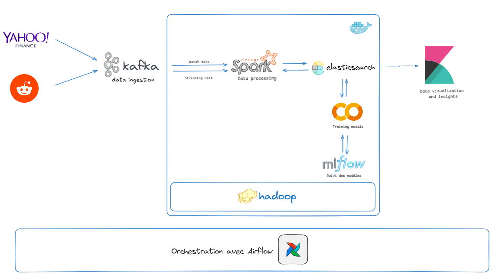

Ce projet a démontré le potentiel du Big Data et de l’analyse des sentiments pour anticiper les variations des actions de Tesla en temps réel. En combinant Apache Kafka, Spark et Elasticsearch avec des modèles LSTM, il a permis de relier données sociales et financières. Malgré son efficacité, des améliorations sont possibles, comme l’élargissement des sources de données et l’intégration de facteurs externes. Ces avancées pourraient affiner les prédictions et ouvrir la voie à des applications financières plus avancées, telles que l’optimisation des portefeuilles et la gestion des risques.

